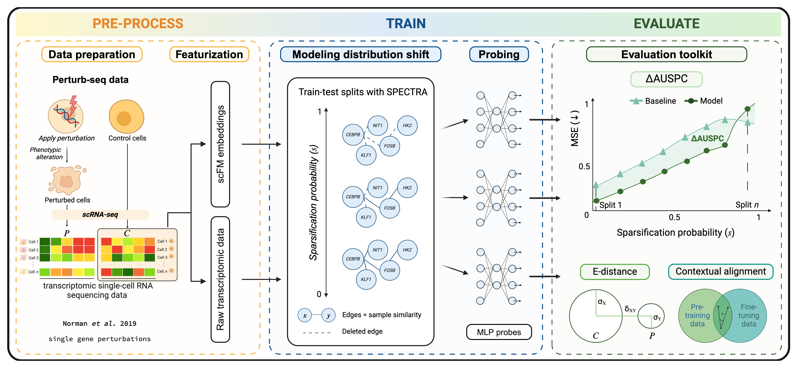

<div align="center">

# PertEval: Evaluating Single-Cell Foundation Models for Perturbation Response Prediction

<a href="https://pytorch.org/get-started/locally/"></a>
<a href="https://pytorchlightning.ai/"></a>
<a href="https://hydra.cc/"></a>
<a href="https://github.com/ashleve/lightning-hydra-template"></a><br>
[](https://www.biorxiv.org/content/10.1101/2024.10.02.616248v1)
<!---
[](https://papers.nips.cc/paper/2020)
--->
</div>

PertEval is a comprehensive evaluation framework designed for perturbation response prediction.

Key features:

- **Extensive Model Support**: Evaluate a wide range of single-cell foundation models using simple probes for perturbation response prediction.
- **Standardized Evaluations**: Consistent benchmarking protocols and metrics for fair comparisons in transcriptomic perturbation prediction.
- **Flexible Integration**: Easily extend the codebase with custom models and datasets for perturbation prediction tasks.
- **Modular Design**: Built on top of PyTorch Lightning and Hydra, ensuring code organization and configurability.

PertEval-scFM is composed of three mains parts: data pre-processing, model training and evaluation




## Installation

<!---
#### Pip

{ADD PIP INSTALL PerturBench}
--->

Setting up conda environment:
```bash
# clone project
git clone https://github.com/aaronwtr/PertEval
cd PertEval

# [OPTIONAL] create conda or virtual environment
conda create -n perteval python=3.10
conda activate perteval
```

Alternatively, using virtualenv:

`python3.10 -m venv perteval`

### Windows:
`perteval\Scripts\activate`

### MacOS/Linux
`source perteval/bin/activate`

### Install requirements
`pip install -r requirements.txt`

[//]: # ()
[//]: # (## Making a Lightning DataModule )

[//]: # ()
[//]: # (Lightning DataModules allows you to add any dataset.)

[//]: # ([Lightning DataModule docs]&#40;https://lightning.ai/docs/pytorch/stable/data/datamodule.html&#41; )

[//]: # ()
[//]: # (## Making a Lightning Module )

[//]: # ()
[//]: # (Lightning Modules allows you to add any perturbation prediction model.)

[//]: # ([Lightning Module docs]&#40;https://lightning.ai/docs/pytorch/stable/common/lightning_module.html&#41;)

## Training and Evaluation

The codebase has two entry points: `train.py` and `eval.py`. Which one you'll use depends on whether you want to train/fine-tune an existing model, or whether you have a pre-trained checkpoint you want to evaluate. The codebase takes care of everything from dataloading and pre-processing to training. It also generates train-test splits with SPECTRA. If you want to investigate the train-test splits, this can be done in [plots/visualize_spectra_norman_1.ipynb](plots/visualize_spectra_norman_1.ipynb)

Train model with default configuration

```bash
# train on CPU
python src/train.py trainer=cpu

# train on GPU
python src/train.py trainer=gpu
```

Train model with chosen experiment configuration from [configs/experiment/](configs/experiment/)

```bash
python src/train.py experiment=experiment_name.yaml
```

You can override any parameter from command line like this

```bash
python src/train.py trainer.max_epochs=20 data.batch_size=64
```

To evaluate your model, run the following command with the path to the checkpoint file

```bash
python src/eval.py ckpt_path="/path/to/ckpt/name.ckpt"
```

## Evaluating on differentially expressed gene for a perturbation  

Step 1) Calculate significant perturbations with E-test [notebooks/preprocessing/significant_perts_edist.ipynb](notebooks/preprocessing/significant_perts_edist.ipynb) 

Step 2) Calculate differentially expressed genes for all significant perturbations [notebooks/preprocessing/diff_exp_refactored.ipynb](notebooks/preprocessing/diff_exp_refactored.ipynb) 

Step 3) Prepare the inference config [configs/experiment/mlp_norman_inference.yaml](configs/experiment/mlp_norman_inference.yaml). 
  - Add the path to the .ckpt file
  - Add model you want to use
  - Add the perturbation to be inspected 
  - Set the proper split and replicate corresponding to the perturbation. (TODO: Automate)
  - Update the corresponding hidden and embedding dimensions (TODO: Automate)
  - (Optional) Prepare shell scripts to run many perturbations at once on an HPC [notebooks/preprocessing/generate_deg_scripts.ipynb](notebooks/preprocessing/generate_deg_scripts.ipynb) 

Step 4) Run eval.py with the inference config,

## Setting up Weights and Biases logging and experiment tracking
First install wandb via 

```bash
pip install wandb
```

and then login by pasting your API key when prompted via

```bash
wandb login
```

Then you can set the wandb project name and entity in the `configs/logger/wandb.yaml`.

```yaml
# set project and entity names in `configs/logger/wandb`
wandb:
  project: "your_project_name"
  entity: "your_wandb_team_name"
```

[//]: # (## Debugging)

[//]: # ()
[//]: # (The codebase is built on top of PyTorch Lightning and Hydra, which provides several useful features for debugging machine learning models. These features can help you quickly identify and fix issues during the training or fine-tuning of your model. Note that logs get placed into `logs/debugs/...`.)

[//]: # ()
[//]: # (#### Single Epoch Debugging)

[//]: # ()
[//]: # (When you want to quickly test your code or debug a specific issue, you can run the training for just a single epoch. This mode enforces debug-friendly configurations, such as setting all command-line loggers to debug mode, which provides more detailed logging output. To run training for a single epoch, use the following command:)

[//]: # ()
[//]: # (```bash)

[//]: # (python train.py debug=default)

[//]: # (```)

[//]: # ()
[//]: # (This mode is particularly useful when you want to verify that your data loading, model architecture, and training loop are working correctly before running the full training process.)

[//]: # ()
[//]: # (#### One Batch Debugging)

[//]: # ()
[//]: # (If you need to debug a specific batch or step in your training, validation, or testing loop, you can run the code for just one batch through each loop. This mode allows you to inspect the intermediate tensors, gradients, and other variables at each step, making it easier to identify and fix issues related to a specific batch or data sample. To run this mode, use the following command:)

[//]: # ()
[//]: # (```bash)

[//]: # (python train.py debug=fdr)

[//]: # (```)

[//]: # ()
[//]: # (This mode is particularly useful when you encounter issues with a specific batch or data sample, such as numerical instabilities, data loading errors, or model output inconsistencies.)

[//]: # ()
[//]: # (#### Overfitting to One Batch)

[//]: # ()
[//]: # (In some cases, you might want to test your model's ability to overfit to a single batch of data. This can be helpful for verifying that your model has enough capacity to learn the training data and for debugging issues related to the optimization process or loss function. To run this mode, use the following command:)

[//]: # ()
[//]: # (```bash)

[//]: # (python train.py debug=overfit)

[//]: # (```)

[//]: # ()
[//]: # (#### Detecting Numerical Anomalies)

[//]: # ()
[//]: # (To detect these anomalies in the model's tensors, you can enable the anomaly detection. This feature will check for NaNs or infinities in your tensors and raise an exception if any are found, helping you identify and fix the root cause of these numerical issues. To enable this feature, use the following command:)

[//]: # ()
[//]: # (```bash)

[//]: # (python train.py +trainer.detect_anomaly=true)

[//]: # (```)

[//]: # ()
[//]: # (This mode is particularly useful when you encounter numerical instabilities or unexpected behaviors during training or inference, as it can help you identify the source of these issues more quickly.)

#### Using a Subset of Data

In some cases, you might want to train or evaluate your model on a smaller subset of your data, either for debugging purposes or to speed up the training process. PyTorch Lightning provides options to limit the number of batches used for training, validation, and testing. For example, to use only 20% of your data for each of these stages, you can run the following command:

```bash
python train.py +trainer.limit_train_batches=0.2 \
+trainer.limit_val_batches=0.2 +trainer.limit_test_batches=0.2
```

This mode can be useful when you want to quickly test your code or debug issues with a smaller subset of your data, or when you want to perform a quick sanity check on your model's performance before running the full training or evaluation process.


